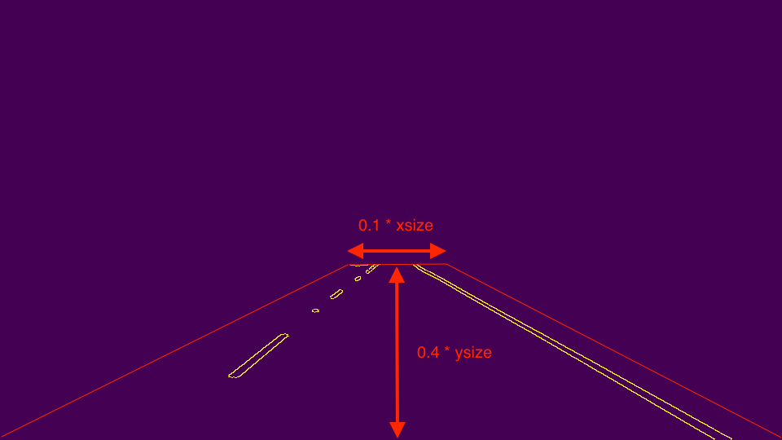
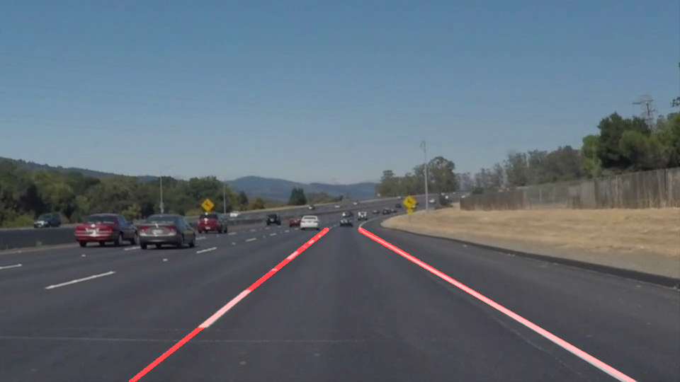
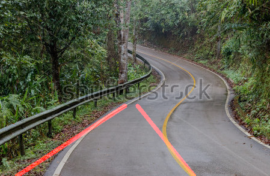
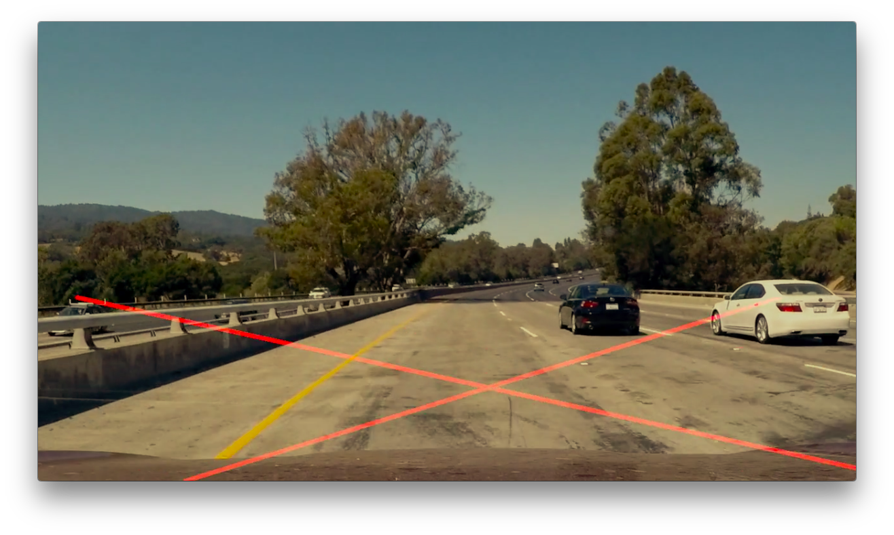

# **Finding Lane Lines on the Road**

## Writeup of CarND-LaneLines-P1
---

**Finding Lane Lines on the Road**

The goals / steps of this project are the following:
* Make a pipeline that finds lane lines on the road
* Reflect on your work in a written report

---

### Reflection

### 1. Describe your pipeline. As part of the description, explain how you modified the `draw_lines()` function.

My pipeline consisted of 5 steps. First, I converted the images to grayscale, then blurred it using Gaussian smoothing to make it easier to detect edges, where the `kernel_size` is 5. After blurring, I detected edges in the image and masked it with a trapezoid whose
* the upper base is (x, y) = (0.45×`xsize`, 0.6×`ysize`) ~ (0.55×`xsize`, 0.6×`ysize`) ,
* the lower base is bottom of the image ,
* the height is 0.4×`ysize` .

(where `xsize` is the horizontal size of the image, `ysize` is the vertical size of the image)

<div style="text-align:center">

</div>

In order to draw a single line on the left and right lanes, I modified the `draw_lines()` function by [RANSAC algorithm](http://scikit-learn.org/stable/auto_examples/linear_model/plot_ransac.html). First, the points of the lines transformed by Hough method were classified whether left line lane or right line lane. After all of the points were classified, the points were fitted into a straight line by [RANSAC algorithm](http://scikit-learn.org/stable/auto_examples/linear_model/plot_ransac.html). To connect the line straight, I calculated a slope `a_line` and a intercept `b_line`, which were averaged by past `N`(this time is 5) frames data in order to decrease an error, from the result of [RANSAC](http://scikit-learn.org/stable/auto_examples/linear_model/plot_ransac.html) fitting. Then draw the line on the image using the the slope `a_line` and the intercept `b_line` within the range of interest region.


<div style="text-align:center">

</div>

If you'd like to include images to show how the pipeline works, here is how to include an image:
```
import matplotlib.image as mpimg

file_name = 'solidWhiteCurve.jpg'
image = mpimg.imread('test_images/' + file_name)
```
how to show the result of the image:
```
import matplotlib.pyplot as plt

plt.imshow(output_image)
```

If you'd like to include videos to show how the pipeline works, here is how to include an image:
```
from moviepy.editor import VideoFileClip

file_name = 'solidWhiteRight.mp4'
clip = VideoFileClip('test_videos/' + file_name)
```
how to show the result of the vidoe:
```
from IPython.display import HTML

HTML("""
<video width="960" height="540" controls>
  <source src="{0}">
</video>
""".format(output_clip))
```

### 2. Identify potential shortcomings with your current pipeline


One potential shortcoming would be that this pipeline could not fit sharp curved line lane well because the RANSAC algorithm in the program was for straight line fitting. If the line lane is not so much curved sharply (e.g. curved line lane in highway), this pipeline will work will because the curved line lane can be recognized as straight line lane only in front of the car. When the program is implemented in the sharply curved line lane, the result would be below :

<div style="text-align:center">

</div>

Another shortcoming could be that this pipeline was hard to recognize the line lane when the color of the road was close to the one of line lane because openCV was using RGB information. Below is the one scene of the result of `challeng.mp4` :

<div style="text-align:center">

</div>


### 3. Suggest possible improvements to your pipeline

A possible improvement would be to use another fitting algorithm which can also deal with curve fitting (second-order polynomial) such as [Robust nonlinear regression](http://scipy-cookbook.readthedocs.io/items/robust_regression.html). Moreover, based on the assumption that line lanes would not move significantly, differential between slopes `a_line` in each frames could be used instead of averaging the slopes `a_line` because the differential should be around zero.

Another potential improvement could be to add other sensors besides RGB sensor such as LiDAR, which can obtain reflectivity information, and [blend the results of these sensors to make the lane detection more robust](https://www.google.com/amp/gpsworld.com/a-comparison-of-lidar-and-camera-based-lane-detection-systems/amp/). Especially when the weather is dark, LiDAR-based method has less error than camera-based one.
